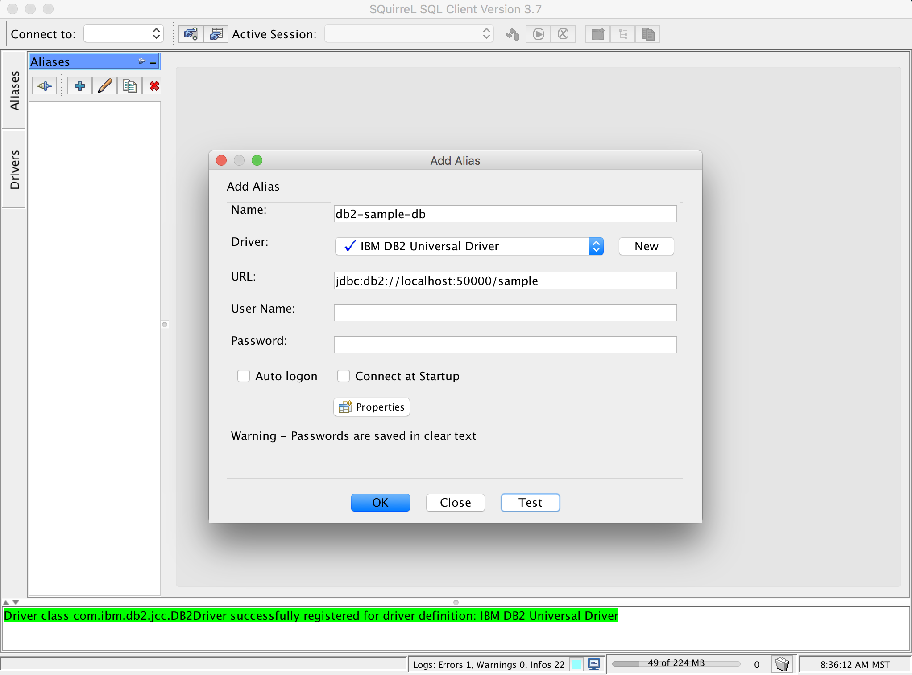
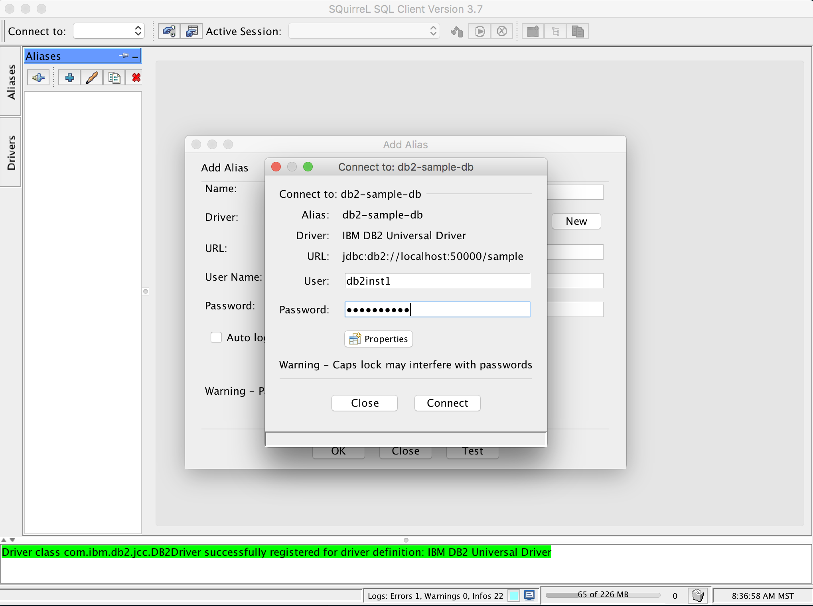
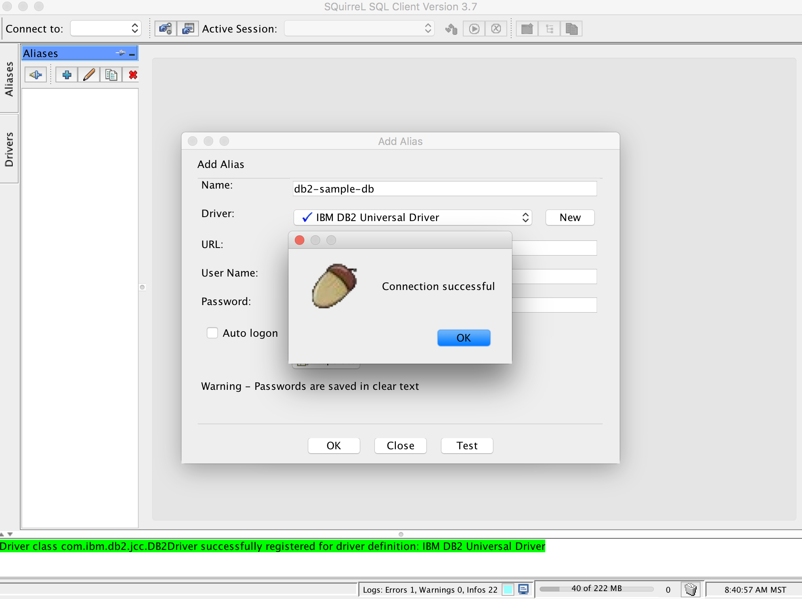
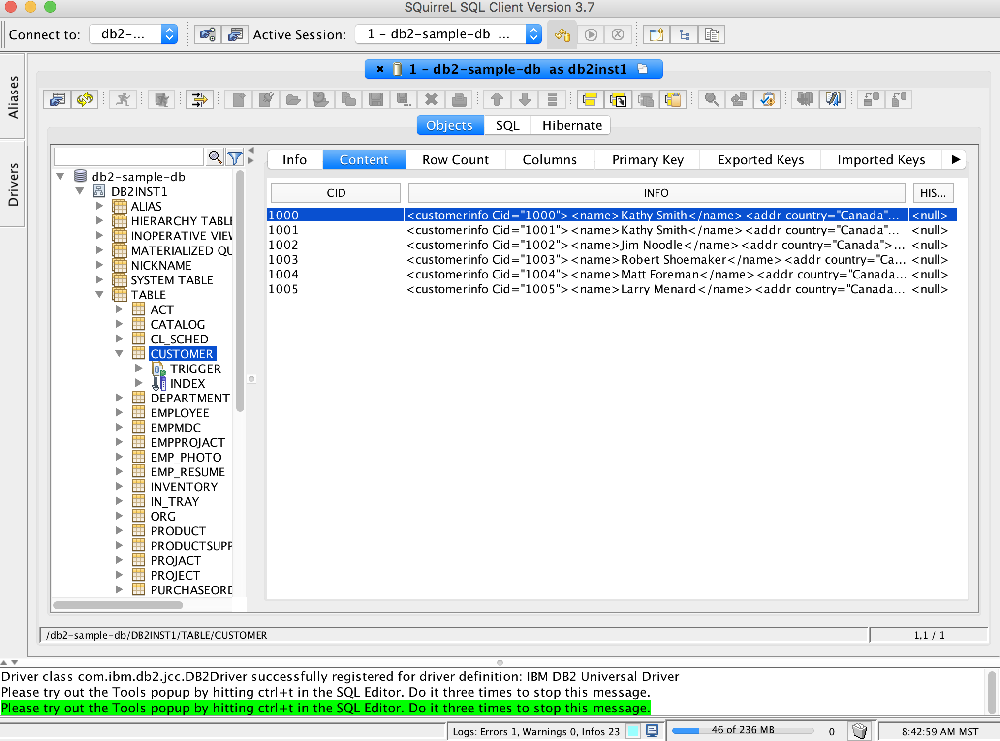

#APF Up and Running

##PreRequisite Installation Requirements

Since the project artifacts are based on Docker containers, i**t is required that your workstation have Docker installed.** 
#####Docker Installation on Linux (direct)
If you are running a current distribution of Linux that supports docker then follow the instructions for your distribution. For convenience, if you are running CentOS version 7 you can run the following from a bash shell:
```bash
#install docker service
cat >/etc/yum.repos.d/docker.repo <<-EOF
[dockerrepo]
name=Docker Repository
baseurl=https://yum.dockerproject.org/repo/main/centos/7
enabled=1
gpgcheck=1
gpgkey=https://yum.dockerproject.org/gpg
EOF
yum -y install docker
systemctl start docker.service
systemctl enable docker.service

#allow non-#access to run docker commands for user vagrant
#if you have problems running docker as the vagrant user on the vm (if you 'vagrant ssh'd in
#after a 'vagrant up'), then
#restart the host machine and ssh in again to the vm 'vagrant halt; vagrant up; vagrant ssh'
groupadd docker
usermod -aG docker vagrant

#install docker-compose.
#Compose is a tool for defining and running multi-container applications with Docker.
yum -y install python-pip
pip install -U docker-compose
```

#####Docker Installation on Windows & Mac OSX (and Linux if you don't want to install Docker directly on your host Linux OS)
You have a choice here to make. Since Docker-Machine installs a lightweight Virtualbox VM with Docker installed in that VM, you can either do that directly by following the instructions at the Docker website (https://docs.docker.com/machine/install-machine/) or you can install a more general purpose Virtualbox VM first and use Vagrant to provision that VM as a Docker-Machine with some additional feature. 

**Option 1:** For the official Docker-Machine installation, follow instructions here https://docs.docker.com/machine/install-machine/ 

**Option 2**: For the more general-purpose VM and control using Vagrant, first follow the installation instructions and links outlined here (https://github.com/petergdoyle/dockerdemo/blob/master/SETUP.md) and install Vagrant and Virtualbox now.


- [ ] If you are on Windows it is highly recommended that you install Git for Windows and a modern text/code editor like Atom. Those installation instructions and links are outlined at (https://github.com/petergdoyle/dockerdemo/blob/master/SETUP.md) as well.
- [ ] If you behind a corporate firewall/proxy then scroll down in this document and read the section on **Proxy Settings** first, make the necessary environment changes first, before you go to the next step (here) after you confirm your bash shell (git bash or otherwise) can connect to the internet. Open a bash shell (git bash for windows, a command shell in OSX or Linux) and run ```curl -i http://www.google.com``` to test that the proxy settings are working. You should get some type of HTTP response code back from google. If you don't then you are going to have to stop here and figure out why not. 
- [ ] Once Vagrant is installed you need to add a plugin to vagrant that will keep the Virtualbox extensions up to date everytime you create a new Virtualbox VM using vagrant. So with the same bash shell type ```vagrant plugin install vagrant-vbguest```. For more information on that plugin, refer to the project documentation https://github.com/dotless-de/vagrant-vbguest
- [ ] Clone the mini-projects repository using that same bash shell by issuing the git command to pull a copy of this repository down to your machine ```git clone https://github.com/petergdoyle/mini-projects.git``` and change to the apf directory ```cd mini-projects/apf``` (the contents of the apf directory is shown in the next section **Project Overview**)
- [ ] If you are behind a corporate firewall/proxy make changes to the Vagrantfile section commented out specifying proxy settings before proceeding. Scroll ahead the section in this document on Proxy Settings and make the appproprate changes in the Vagrantfile. Feel free to use Atom to do that work launching the program and opening the folder where mini-projects/apf is located. That will alow you to make the changes. 
- [ ] Now you should be able to create the Docker-based VM. So with the same bash shell issue the vagrant command to create a new VM that we will use for this project. Type ```vagrant up``` now and you should see the machine being created from a base image and then provisioned with the necessary tools and software for our purposes here. 
- [ ] You should have received some type of success message from Vagrant that the VM got set up successfully. If not, it is likely the Proxy Settings. Recheck all that and type ```vagrant provision``` and that should restart the section of instructions in the Vagrantfile that will install the Docker-machine and other utilities and software required to continue.
- [ ] Once you have a successfully install VM, then restart it. Type the command ```vagrant halt && vagrant up``` to do that. You may see some additional installation steps running to update the Virtualbox Guest Extensions, etc. 
- [ ] Okay now you should be able to ssh into your VM. Type the command ```vagrant ssh``` and you should find yourself at the bash shell of the VM and see the vagrant user at the apfvm machine
```bash
[vagrant@apfvm ~]$
```
- [ ] Now test the Docker installation. Use the ```docker ps -a``` command and you should see something like the following:
```bash
[vagrant@apfvm ~]$ docker ps -a
CONTAINER ID        IMAGE                   COMMAND                  CREATED             STATUS              PORTS                              NAMES
```
- [ ] Now pull a Docker image to make the installation test complete. You should see Docker go out to Docker Hub and pull the official CentOS 7 image. Use the ```docker pull``` command:
```bash
[vagrant@apfvm ~]$ docker pull centos
...
...
```
- [ ] Once that finishes, you should see the image now pulled to your local repository. Use the ```docker images``` command:
```bash
[vagrant@apfvm ~]$  docker images
REPOSITORY                      TAG                 IMAGE ID            CREATED             VIRTUAL SIZE
docker.io/centos                7                   bb3d629a7cbc        4 days ago          196.6 MB
```


##Project Overview
The project is organized into several sections. Since the mini-projects is a multi project repository, the descriptions and instructions here assume that you are in the *mini-project-dir*/apf directory. So references in this document to file/folder locations assume that *mini-project-dir*/apf is the current working directory.

	.
    ├── README.md
    ├── Vagrantfile
    ├── apf-master
    │   ├── Dockerfile
    │   ├── apf-data-access
    │   ├── apf-services
    │   ├── apf-web-jsf
    │   ├── apf-web-spring-mvc
    │   ├── clean_and_build.sh
    │   ├── conf
    │   ├── docker_build.sh
    │   ├── docker_run.sh
    │   ├── lib
    │   └── pom.xml
    ├── docker
    │   ├── base
    │   ├── db2client
    │   ├── db2express
    │   ├── jdk8
    │   ├── jenkins
    │   └── tomcat8
    ├── docker_build_all.sh
    ├── docker_clean_all.sh
    ├── docker_remove_all_containers.sh
    ├── docker_remove_all_images.sh
    ├── docker_start_all_containers.sh
    ├── docker_stop_all_containers.sh
    ├── ibm
    │   ├── drivers
    │   ├── mvn_install_db2-express-c_jdbc_drivers.sh
    │   └── mvn_remove_db2-express-c_jdbc_drivers.sh
    └── scripts
        ├── color_and_format_functions.sh
        └── docker_functions.sh


###Project Setup Steps (once a Docker Machine is installed)
#####Build the base images
This project will use Docker to contain running instances of the software we need to complete the project, so Docker needs to be installed and working properly at this point. If not, go throug the PreRequisite Installation steps first. If you are behind a corporate firewall/proxy then you will have to make changes to the Docerfile located in ```apf/docker/base``` directory first as outlined in the Proxy Settings section. Once that is done then continue along here. In the root directory there are a number of scripts to run to build the Docker images. These can be all built at once in the correct order by running the docker_build_all shell script from the apf/ directory.
```bash
$ ./docker_build_all.sh
```
If the containers were built successfully you should see messages like the following:

	the docker build for ./docker/* built successfully

If you see error messages you will have to find out what went wrong and fix the errors before proceeding. If all looks good then check that the Docker images are built by typing the Docker command to list them:
```bash
[vagrant@apfvm db2express]$ docker images
REPOSITORY                      TAG                 IMAGE ID            CREATED             VIRTUAL SIZE
apf/db2client                   latest              33776b83635b        11 minutes ago      956 MB
apf/tomcat8                     latest              f23fd9a3378f        16 minutes ago      961.5 MB
apf/jenkins                     latest              2a80414f9f8e        16 minutes ago      950.1 MB
apf/jdk8                        latest              d88c8e2882e5        17 minutes ago      948.5 MB
apf/base                        latest              bc7b6e238bc4        18 minutes ago      402.4 MB
apf/db2express                  latest              d2b5ec0e260c        34 minutes ago      1.851 GB
docker.io/centos                7                   bb3d629a7cbc        3 days ago          196.6 MB
docker.io/ibmcom/db2express-c   latest              3673a5923f7f        9 months ago        1.705 GB

```
You should see the required images for this project with the ```apf/``` namespace. Make sure everything built succesfully before proceeding.

#####Set up the db2 database
Move into the ```docker/db2express``` directory and list the contents
```bash
[vagrant@apfvm vagrant]$ cd docker/db2express/
[vagrant@apfvm db2express]$ ll
total 28
-rwxr-xr-x. 1 vagrant vagrant   76 Mar  6 16:46 create_sample_db.sh
-rwxr-xr-x. 1 vagrant vagrant  153 Mar  6 16:46 docker_build.sh
-rwxr-xr-x. 1 vagrant vagrant   79 Mar  6 16:46 docker_destroy.sh
-rw-r--r--. 1 vagrant vagrant  215 Mar  6 16:46 Dockerfile
-rwxr-xr-x. 1 vagrant vagrant  359 Mar  6 16:46 docker_run.sh
-rwxr-xr-x. 1 vagrant vagrant   58 Mar  6 16:46 docker_shell.sh
-rwxr-xr-x. 1 vagrant vagrant 1493 Mar  6 16:46 entrypoint.sh
```
Now that the Docker images are built we can then run a db2 container. So now we need to run a container by running the docker_run script.
```bash
[vagrant@apfvm db2express]$ ./docker_run.sh
ed5e534efb1ea0347064e2a2b3146054f2352bacf8b506e41e466e03f2e4fb05
```
Okay, now let's check on the container. You can see running containers with the ```docker ps``` command. So let's check the status of the container we just created. It was named ```apf_db2express_server``` by the docker_run script.
```bash
[vagrant@apfvm db2express]$ docker ps -a
CONTAINER ID        IMAGE                   COMMAND                  CREATED              STATUS              PORTS                              NAMES
ed5e534efb1e        apf/db2express:latest   "/entrypoint.sh db2st"   About a minute ago   Up About a minute   0.0.0.0:50000->50000/tcp, 22/tcp   apf_db2express_server
```
Now, let's create the db2sampl database so we can check connectivity between the container and the docker machine. We need to run the script that executes a directive in the container to create the db2 sample database. So run the create_sample_db and you should see the following:
```bash
[vagrant@apfvm db2express]$ ./create_sample_db.sh

  Creating database "SAMPLE"...
  Connecting to database "SAMPLE"...
  Creating tables and data in schema "DB2INST1"...
  Creating tables with XML columns and XML data in schema "DB2INST1"...

  'db2sampl' processing complete.

```

So now let's switch to the db2client folder and see what is in there. This contains a program that will test the db2 database installation and look for the sample db database.
```bash
[vagrant@apfvm db2express]$ cd ../db2client/
[vagrant@apfvm db2client]$ ll
total 20
-rwxr-xr-x. 1 vagrant vagrant 190 Mar  6 16:46 clean_and_build.sh
drwxr-xr-x. 1 vagrant vagrant 170 Mar  8 09:15 db2client
-rwxr-xr-x. 1 vagrant vagrant 173 Mar  6 16:46 docker_build.sh
-rw-r--r--. 1 vagrant vagrant 196 Mar  6 16:46 Dockerfile
-rwxr-xr-x. 1 vagrant vagrant 352 Mar  6 16:46 docker_run_client.sh
-rwxr-xr-x. 1 vagrant vagrant 180 Mar  8 07:46 test_db2client.sh
```

Okay, now let's run the clean_and_build to build that java program that should connect to the database and indicate that the database is available. We can do this and run the test_db2client script with one command:
```bash
[vagrant@apfvm db2client]$ ./clean_and_build.sh && ./test_db2client.sh
[INFO] Scanning for projects...
[INFO]                                                                         
[INFO] ------------------------------------------------------------------------
[INFO] Building db2client 1.0-SNAPSHOT
[INFO] ------------------------------------------------------------------------
[INFO]
[INFO] --- maven-clean-plugin:2.5:clean (default-clean) @ db2client ---
[INFO] Deleting /vagrant/docker/db2client/db2client/target
[INFO]
[INFO] --- maven-resources-plugin:2.6:resources (default-resources) @ db2client ---
[INFO] Using 'UTF-8' encoding to copy filtered resources.
[INFO] skip non existing resourceDirectory /vagrant/docker/db2client/db2client/src/main/resources
[INFO]
[INFO] --- maven-compiler-plugin:3.1:compile (default-compile) @ db2client ---
[INFO] Changes detected - recompiling the module!
[INFO] Compiling 1 source file to /vagrant/docker/db2client/db2client/target/classes
[INFO]
[INFO] --- maven-resources-plugin:2.6:testResources (default-testResources) @ db2client ---
[INFO] Using 'UTF-8' encoding to copy filtered resources.
[INFO] skip non existing resourceDirectory /vagrant/docker/db2client/db2client/src/test/resources
[INFO]
[INFO] --- maven-compiler-plugin:3.1:testCompile (default-testCompile) @ db2client ---
[INFO] Nothing to compile - all classes are up to date
[INFO]
[INFO] --- maven-surefire-plugin:2.12.4:test (default-test) @ db2client ---
[INFO] No tests to run.
[INFO]
[INFO] --- maven-jar-plugin:2.4:jar (default-jar) @ db2client ---
[INFO] Building jar: /vagrant/docker/db2client/db2client/target/db2client-1.0-SNAPSHOT.jar
[INFO]
[INFO] --- maven-install-plugin:2.4:install (default-install) @ db2client ---
[INFO] Installing /vagrant/docker/db2client/db2client/target/db2client-1.0-SNAPSHOT.jar to /home/vagrant/.m2/repository/com/travelport/apf/db2client/1.0-SNAPSHOT/db2client-1.0-SNAPSHOT.jar
[INFO] Installing /vagrant/docker/db2client/db2client/pom.xml to /home/vagrant/.m2/repository/com/travelport/apf/db2client/1.0-SNAPSHOT/db2client-1.0-SNAPSHOT.pom
[INFO]
[INFO] --- maven-dependency-plugin:2.8:copy-dependencies (default) @ db2client ---
[INFO] Copying db2jcc-v10.5fp1.jar to /vagrant/docker/db2client/db2client/target/lib/db2jcc-v10.5fp1.jar
[INFO] Copying db2jcc4-v10.5fp1.jar to /vagrant/docker/db2client/db2client/target/lib/db2jcc4-v10.5fp1.jar
[INFO] ------------------------------------------------------------------------
[INFO] BUILD SUCCESS
[INFO] ------------------------------------------------------------------------
[INFO] Total time: 3.257 s
[INFO] Finished at: 2016-03-08T09:33:08-05:00
[INFO] Final Memory: 18M/43M
[INFO] ------------------------------------------------------------------------
/vagrant/docker/db2client
connection to sample db2 database [jdbc:db2://127.0.0.1:50000/sample] successful!
/vagrant/docker/db2client
```

Make sure the message ```connection to sample db2 database [jdbc:db2://127.0.0.1:50000/sample] successful!``` is shown.


Any of these test should all work to test on all interfaces.
```bash
[vagrant@apfvm db2client]$ ./test_db2client.sh
connection to sample db2 database [jdbc:db2://localhost:50000/sample] successful!
/vagrant/docker/db2client
[vagrant@apfvm db2client]$ ./test_db2client.sh jdbc:db2://127.0.0.1:50000/sample
connection to sample db2 database [jdbc:db2://127.0.0.1:50000/sample] successful!
/vagrant/docker/db2client
[vagrant@apfvm db2client]$ ./test_db2client.sh jdbc:db2://0.0.0.0:50000/sample
connection to sample db2 database [jdbc:db2://0.0.0.0:50000/sample] successful!
/vagrant/docker/db2client
```

Now switch out the host machine (if you are running on top of a Vagrant managed vm) and the db2 connection from the host. You should see the same thing.
```bash
/Users/peter/vagrant/mini-projects/apf/docker/db2client
Peters-iMac:db2client peter$ ./test_db2client.sh
connection to sample db2 database [jdbc:db2://localhost:50000/sample] successful!
/Users/peter/vagrant/mini-projects/apf/docker/db2client
```
####Squirrel SQL

#####Install Squirrel SQL
http://squirrel-sql.sourceforge.net/#installation 

#####Configure Squirrel SQL

When you setup the Driver you will need to provide the db2 jdbc drivers. I created a script to download and store them in the ```ibm/drivers``` folder. You need to point to these when the next step wants you to "add the two jar files" for the db2 driver configuration. 

```bash
[vagrant@apfvm vagrant]$ cd ibm
[vagrant@apfvm ibm]$ ll
total 8
drwxr-xr-x. 1 vagrant vagrant 136 Mar  8 10:32 drivers
-rwxr-xr-x. 1 vagrant vagrant 777 Mar  8 09:40 mvn_install_db2-express-c_jdbc_drivers.sh
-rwxr-xr-x. 1 vagrant vagrant  57 Mar  8 09:39 mvn_remove_db2-express-c_jdbc_drivers.sh
[vagrant@apfvm ibm]$ ./mvn_install_db2-express-c_jdbc_drivers.sh 
...
[vagrant@apfvm ibm]$ ll drivers
total 7348
-rw-r--r--. 1 vagrant vagrant 3866524 Mar  8 10:32 db2jcc4.jar
-rw-r--r--. 1 vagrant vagrant 3656105 Mar  8 10:32 db2jcc.jar

```

Now on the host machine (not the Vagrant managed vm, but one level up) and then install Squirrel SQL to connect to the database.

	Configure Squirrel SQL to connect to IBM DB2
	"Squirrel SQL" is a great light weight generic SQL client that I have started using for more than 7 years now.

	This is how to configure Squirrel SQL 3.3.0 to connect to DB2 server, I have installed IBM DB2 admin client 9.7 - 64 bit software on my Windows 7 enterprise SP1. You will find two types of DB2 drivers APP & NET, most recommended way is to use type 4 JDBC driver (thin) that actually doesn't require client installation, but require proper jar files and associated license.

	Steps:
	1- Open Driver list from left menu, click the plus sign "Create a New Driver".
	2- Type "IBM DB2 Universal Driver" in "Name" textbox.
	3- Type "jdbc:db2://localhost:50000/sample" in "Example URL" textbox.
	4- Type "com.ibm.db2.jcc.DB2Driver" in "Class Name" editable dropdown list.
	5- Click "Extra Class Path" tab.
	6- Click "Add" and select two jar files from %DB2_INSTALL%\java\db2jcc.jar & %DB2_INSTALL%\java\db2jcc_license_cu.jar
	7- Click Ok, and we are done defining the driver.
	8- Now create an alias for the DB using previous driver and providing URL, username, & password.

Now you should be able to connect using the gui based Squirrel SQL
So after you configure the Driver, then add an Alias and connect to the container-ized db2 instance.


Then test that with the test button the username/password we set (in the create_db script) is db2inst1/magic_mike, so try that out and you should see a success icon pop up





Now if you save that Alias and drill down into the db2-sample-db/DB2INST1/TABLE/CUSTOMER table you should see some data that we loaded into the sample database





##Proxy Settings

###Git Bash (if you are using windows)

If you are running behind a corporate firewall/proxy enter these lines into a Git Bash shell. Change the sample http://myproxy.net:80 as required.

```bash
export HTTP_PROXY=http://myproxy.net:80
export HTTPS_PROXY=$HTTP_PROXY 
export http_proxy=$HTTP_PROXY 
export https_proxy=$HTTP_PROXY
cat >~/.bashrc <<-EOF
export HTTP_PROXY=$HTTP_PROXY
export HTTPS_PROXY=$HTTP_PROXY
export http_proxy=$HTTP_PROXY
export https_proxy=$HTTP_PROXY
EOF
```

###Vagrant (if you are running Docker on a VM)

If you are running behind a corporate firewall/proxy comment out these lines in the Vagrantfile and set the proxy host and port. Open up atom or another text editor and modify the section that sets the proxy for the vm. Change the sample http://myproxy.net:80 as required.
```
# Global Proxy Settings
export HTTP_PROXY=http://myproxy.net:80
export HTTPS_PROXY=$HTTP_PROXY 
export http_proxy=$HTTP_PROXY 
export https_proxy=$HTTP_PROXY
echo "proxy=$HTTP_PROXY" >> /etc/yum.conf
#global settings
cat >/etc/profile.d/proxy.sh <<-EOF
export HTTP_PROXY=$HTTP_PROXY
export HTTPS_PROXY=$HTTP_PROXY
export http_proxy=$HTTP_PROXY
export https_proxy=$HTTP_PROXY
EOF
```

###Docker Containers
If you are running behind a corporate firewall/proxy then you need to provide the details of the proxy to the containers as many utilities to run the containers rely on access to the internet and require the proxy server to connect.

You need to modify the setting in the docker/base set_proxy script
```bash
Peters-MacBook-Pro:apf peter$ tree docker/base/
docker/base/
├── Dockerfile
├── docker_build.sh
└── set_proxy.sh
```
open up the set_proxy.sh with atom or another text editor and modify the first entry http://myproxy.net:80 as required. This will set the container up to use the appropriate proxy to access the internet as required. 

```
#!/bin/sh

# Global Proxy Settings
export HTTP_PROXY=http://myproxy.net:80
export HTTPS_PROXY=$HTTP_PROXY
export http_proxy=$HTTP_PROXY
export https_proxy=$HTTP_PROXY
echo "proxy=$HTTP_PROXY" >> /etc/yum.conf

# GlobalSettings
cat >/etc/profile.d/proxy.sh <<-EOF
export HTTP_PROXY=$HTTP_PROXY
export HTTPS_PROXY=$HTTP_PROXY
export http_proxy=$HTTP_PROXY
export https_proxy=$HTTP_PROXY
EOF
```